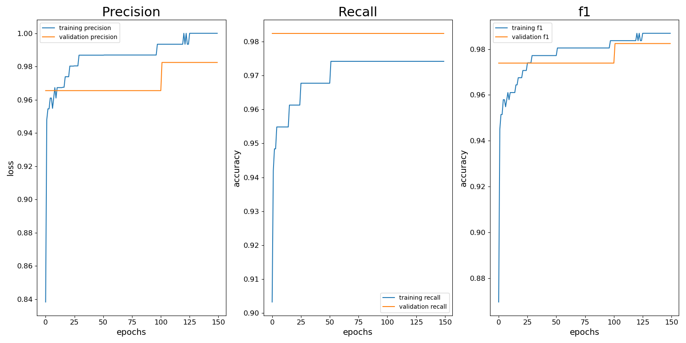
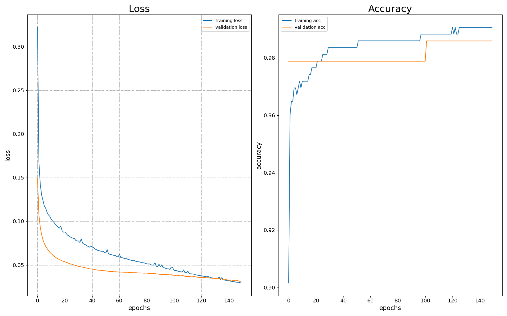

# Multilayer-Perceptron
Multilayer Perceptron implementation from scratch in Python.

The model is applied to a **binary classification problem** (Breast Cancer dataset) to predict whether a tumor is malignant or benign.


##  Features
- Implemented from scratch with pure **NumPy**
- Supports **ReLU** and **Softmax** activations
- Implements **categorical cross-entropy** and **binary cross-entropy** losses
- Includes **SGD** and **Adam** optimizers
- Supports **mini batch training**
- Built-in **early stopping**
- **Metrics tracking** (accuracy, precision, recall, F1)
- Generates **training/validation loss and accuracy plots**
- Includes **data preprocessing**, exploring graphs and feature normalization
- Model weights and preprocessing steps are saved for inference

---
### Install requirements
- numpy
- pandas
- scikit-learn
- matplotlib

## Run the program 


**1. Split dataset**
```bash
python3 split.py data.csv
```

or do split and show some data analysis exploration graphs (see below):
```bash
python3 split.py data.csv --p
```

**Distribution between diagnosis**

Shows that negative cases are a lot more than positive so that means that class distribution is not very balanced therefore when spliting the data set I take equal part of each class and place it into test & train set.


**Distribution of diagnosis in each feature**

Shows that some features are very simillar which possibly means that some of them can be removed (using Random forest model) and some feaures do not separate 2 classes very which means those can be removed as well (using AUC score)
See that in data_pipline.py.


**2. Train the model**
```bash
python3 train.py train.csv test.csv --layer 12 12 --epochs 150 --loss categorical_cross_entropy --batch_size 16 --learning_rate 0.001
```

Example output:
```bash
x_train shape :  (427, 20)
x_valid shape :  (142, 20)

epoch 01/150 - loss: 0.6112 - val_loss: 0.4411
epoch 10/150 - loss: 0.1272 - val_loss: 0.1316
epoch 20/150 - loss: 0.0928 - val_loss: 0.1068
epoch 30/150 - loss: 0.0765 - val_loss: 0.0999
epoch 40/150 - loss: 0.0655 - val_loss: 0.0980
epoch 50/150 - loss: 0.0583 - val_loss: 0.0977
epoch 60/150 - loss: 0.0531 - val_loss: 0.0992

Early stopping at 68
```

**Saving & Loading**
- Trained model parameters are saved in **model.npz**.

- Preprocessing steps are saved in **preprocessor.pkl**. It is done using Pickle module. It converts Python object into bytes. So now the file remembers the object's structure and data and the same serialization can be applied to the test data set in prediction program converting back the file into an object.

- Metrics are saved in **metrics_history.csv**. Loss and accuracy is ploted down below.

Precision = How many of the predicted positives were actually correct?  
` Precision = TP / (TP + FP)`

Recall = How many of the actual positives did your model find?  
` Recall = TP / (TP + FN)`

F1-score = The balance between precision and recall.  
` F1 = 2 * (precision * recall) / (precision + recall)`


**Precision, recall and f1**




**Loss and Accuracy plots**




**3. Prediction**
```bash
python3 prediction.py --weights model.npz --preprocessor preprocessor.pkl --input_set test.csv
```

Example output:
```bash
Loss: 0.06, Accuracy: 97.89 %
```
